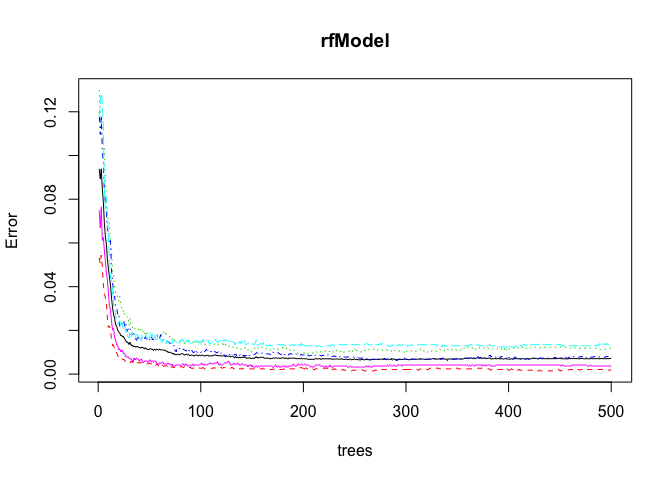

# Practical Machine Learning Project

#Executive Summary
Human Activity Recognition - HAR - has emerged as a key research area in the last years, 
especially for the development of context-aware systems. Potential applications for HAR, like: elderly monitoring, life log systems for monitoring energy expenditure and for supporting weight-loss programs, and digital assistants for weight lifting exercises.

For this particular dataset, we focus in the latter, the goal is to use data from accelerometers on the belt, forearm, arm, and dumbell of 6 participants. They were asked to perform barbell lifts correctly and incorrectly in 5 different ways. Using the predictor variables, accurately predict the "classe" variable.

Datasets are the following:
- [Training set](https://d396qusza40orc.cloudfront.net/predmachlearn/pml-training.csv)
- [Test set](https://d396qusza40orc.cloudfront.net/predmachlearn/pml-testing.csv)

The main page with the documentation: [HAR](http://groupware.les.inf.puc-rio.br/har)

#Data Processing
Set up the libraries to be used. Caret as a comprehensive library for machine learning.
dplyr data manipulation, randomForest as an instance of a ML algorithm to be used.

```r
library(caret); library(dplyr); library(randomForest); 
```

Define a function to download data, and assign it to the variables we will used.
Use the URL's provided in the description of the project.

```r
#Function to download data, store in temporary file, assign to variables
downloader <- function(url){
    temp <- tempfile()
    download.file(url,temp, method="curl")
    data <- read.csv(temp)
    unlink(temp)
    data
}

train_url <- "https://d396qusza40orc.cloudfront.net/predmachlearn/pml-training.csv"
test_url <- "https://d396qusza40orc.cloudfront.net/predmachlearn/pml-testing.csv"

train <- downloader(train_url)
test <- downloader(test_url)
```

##Cleaning data
Create a function that does the following:

1) Check data for near Zero Variance variables, variables that are not particularly useful for prediction, take those variables out of the data frame.

2) Check data for variables with high proportions of NA values, in this data set particularly are easy to identify. Take out those variables.

3) Remove additional variables providing their names (id variables, time variables, etc.)

```r
condition <- function(df,x,rest){
    index <- nearZeroVar(df)
    df <- df[,-index]
    index <- matrix()
    for(i in 1:ncol(df)) if(mean(!is.na(df[,i]))>x) index <- cbind(index,i)
    df <- df[,index[-1]]
    df <- select(df,-one_of(rest))
    df
}
```

Run the function with the following variables, names of variables no relevant for classification, the percentage of admitable NA's per column and the data set. Before we had a total of 19622 observations with 159 predictors and 1 prediction, we drop the number of predictors to 52.

```r
desc <- c("X", "user_name", "raw_timestamp_part_1", "raw_timestamp_part_2", "cvtd_timestamp", "new_window", "num_window")
train <- condition(train,0.40,desc)
```

##Splitting data: Training and Validation
Random Subsampling of the data to create the training set and the validation set 60%/40% used, create index for the subsets. This allows to have a validation set to estimate the error on the test dataset.

```r
index <- createDataPartition(train$classe, p=0.6, list=FALSE)
trainF <- train[index,]
valid <- train[-index,]
```

##Random Forest
Random Forest is one of the most accurate predicting algorithms, after pre processing the data, we call the function to predict "classe" with all the variables left. Create the model and see how it performs against itself (training data) and against the validation data. Once confident that our prediction values are good enough, generate the answers prediction to submit. For the sake of brevity, only Random Forest is evaluated here. 

Plot the rfModel to se the effect of the number of trees against the measured error.  We see that rapidly the error drops and then it stabilizes for greater quantities of trees. From the validation data we expect accurancy > 99%.

```r
rfModel <- randomForest(classe ~ ., data = trainF, importance = TRUE, ntrees = 10)
plot(rfModel)
```

 

```r
trainP <- predict(rfModel, trainF)
confusionMatrix(trainP,trainF$classe)$table
```

```
##           Reference
## Prediction    A    B    C    D    E
##          A 3348    0    0    0    0
##          B    0 2279    0    0    0
##          C    0    0 2054    0    0
##          D    0    0    0 1930    0
##          E    0    0    0    0 2165
```

```r
validP <- predict(rfModel, valid)
confusionMatrix(validP,valid$classe)$table
```

```
##           Reference
## Prediction    A    B    C    D    E
##          A 2230    7    0    0    0
##          B    0 1507   11    0    0
##          C    2    4 1356   16    1
##          D    0    0    1 1269    2
##          E    0    0    0    1 1439
```

```r
confusionMatrix(validP,valid$classe)$overall
```

```
##       Accuracy          Kappa  AccuracyLower  AccuracyUpper   AccuracyNull 
##      0.9942646      0.9927447      0.9923330      0.9958136      0.2844762 
## AccuracyPValue  McnemarPValue 
##      0.0000000            NaN
```

```r
answers <- predict(rfModel, test)
```

##Results
Fortunatelly the algorithm adequatelly predicted all the values, use the code provided to create the n txt files with the answers for submission.

```r
pml_write_files = function(x){
    n = length(x)
    for(i in 1:n){
        filename = paste0("problem_id_",i,".txt")
        write.table(x[i],file=filename,quote=FALSE,row.names=FALSE,col.names=FALSE)
    }
}
pml_write_files(answers)
```
